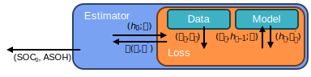

Offline Estimators
------------------

.. :: Add labels for the symbols into the figures

The :class:`~moirae.estimators.online.OfflineEstimator` defines the interface for all offline estimators.
The **Estimator** finds the minimum of a **Loss** function by adjusting inferences
for both the initial transient state of a system and any state-of-health parameters
`marked as updatable <../system-models.html#controlling-which-parameters-are-updatable>`_.

The **Loss** function translates the inputs from the estimator into the
initial state (:math:`h_0`) and ASOH parameters (:math:`\theta`)
then uses those parameters to simulate the evolution of the system according to a **Model**
following the inputs (:math:`u`) provided in operation **Data**.
Loss functions typically compare the voltage observed in the data (:math:`y`) to that
predicted by the model (:math:`y^\prime`)
The objective returns a scalar fitness metric used by the Estimator to find best parameters.

Building an Estimator
+++++++++++++++++++++

First construct an objective function for the optimizer, which requires

1. The :class:`~moirae.models.base.CellModel` defining system physics
2. A starting guess for the transient state
3. A starting guess for the state of health
4. The observation data as a :class:`~battdat.data.BatteryDataset`

Objective functions are available in the :mod:`moirae.estimators.offline.loss` module.

.. code-block:: python

    loss = MeanSquaredLoss(
        cell_model=ecm,
        transient_state=state,
        asoh=asoh,
        observations=dataset
    )

Then provide the objective function to an ``OfflineEstimator`` class along with
any options related to how that optimizer functions.

.. code-block:: python

    scipy = ScipyMinimizer(loss, method='Nelder-Mead')

Using an Estimator
++++++++++++++++++

Begin the state estimation by calling the ``estimate`` method of the Estimator,
which optimizes the transient state and ASOH parameters.

.. code-block:: python

    state_0, asoh, result = scipy.estimate()

The ``state_0`` is an estimate for the starting transient state,
``asoh`` is an estimate for the state of health during the entire
extent of the battery data,
and ``result`` is a diagnostic measure specific to the Estimator.

