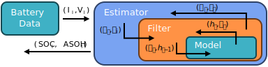

Online Estimators
-----------------

.. :: Perhaps it would be good to provide another version of this figure that would illustrate how to accommodate additional filters. -noah

The :class:`~moirae.estimators.online.OnlineEstimator` defines the interface for all online estimators.
The **Estimator** operates using at least one **Filter**, which each rely on a **Model** to estimate
how parameters evolve with time.

Building an Estimator
+++++++++++++++++++++

The online estimator is composed of one or more filters which estimate the values of different parts
of the battery state in tandem.
The framework in which the filters interact is defined by the choice of
:class:`~moirae.estimators.online.OnlineEstimator`, which includes the
:class:`~moirae.estimators.online.joint.JointEstimator`.

Build an estimator by first constructing a :class:`~moirae.estimators.online.utils.model.BaseCellWrapper` that defines how
to update or estimate the measurements of a system for each subset of variables being estimated.
Each estimator how the they interact with the underlying :class:`~moirae.models.base.CellModel`
and :class:`~moirae.models.base.DegradationModel`.
Moirae provides a library of wrappers with a consistent interface so that
all estimators can work with any Filter or Model.
For example, the :class:`~moirae.estimators.online.joint.JointEstimator` requires
the :class:`~moirae.estimators.online.utils.model.JointCellModelWrapper`.

.. code-block:: python

    cell_function = JointCellModelWrapper(
      cell_model=ecm,
      asoh=rint_asoh,
      transients=rint_transient,
      input_template=rint_inputs,
      asoh_inputs=('r0.base_values',),
    )

Build the filters that will update the estimate of parameters next.
Every type of filter requires the model wrapper and initial estimates for the values of parameters.
The initial estimates for parameters and the inputs to the system are defined as
:mod:`~moirae.estimators.online.filters.distributions`,
which are created from NumPy arrays of parameters.
The `Unscented Kálmán Filter <https://en.wikipedia.org/wiki/Kalman_filter#Unscented_Kalman_filter>`_
is a common choice:

.. code-block:: python

    ukf = UKF(
      model=cell_function,
      initial_hidden=MultivariateGaussian(
        mean=np.array([0., 0., 0.05]),  # Three parameters: SOC, hysteresis, R0
        covariance=np.diag([0.01, 0.01, 0.01])
      ),
      initial_controls=MultivariateGaussian(
        mean=np.array([0., 1., 25.]),  # Three inputs: Time, Current, Temperature
        covariance=np.diag([0.001, 0.001, 0.5])
      )
    )

Assemble the filters together to form the estimator as the last step.

.. code-block:: python

    ukf_joint = JointEstimator(joint_filter=ukf)

Estimators provide class methods that assemble common patterns of wrapper and filters in a single step.
Read the documentation on each filter type for further details.

.. toctree::
    :maxdepth: 2

    joint
    dual
    conversions

Using an Estimator
++++++++++++++++++

Use the estimator by calling the ``step`` function to update the estimated state
provided a new observation of the outputs of the system.

The ``step`` function returns a probability distribution of the expected state
and expected outputs.

.. code-block:: python

    # Generate inputs and expected outputs
    next_inputs = ECMInput(time=1., current=1.)
    expected_transients = ECMTransientVector.provide_template(has_C0=False, num_RC=0)
    next_outputs = ecm.calculate_terminal_voltage(next_inputs, expected_transients, rint_asoh)

    # Step the estimator
    state_dist, output_dist = ukf_joint.step(
      next_inputs,
      next_outputs
    )

All estimators provide access to the state through the ``estimator.state`` attribute,
which can include elements from the transient and ASOH.

Retrieve the identities of each state variable using ``estimator.state_names``
or access the current estimates for the transient state and ASOH via the
``get_estimated_state`` method.
